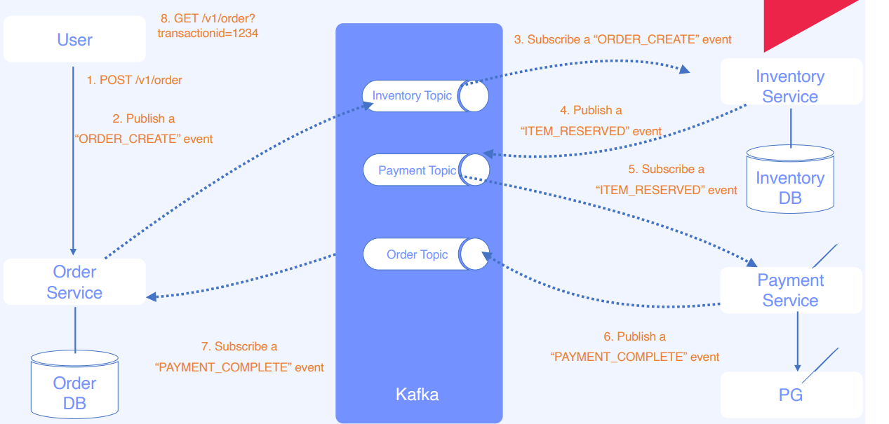

# EDM으로 구현하는 Order Api

## 1. Order 서비스 아키텍처

[3.MSA과 EDM](https://www.notion.so/3-MSA-EDM-a8eb91c9d6bf453d9a510e0bce75b107) 



1. 사용자가 Order Api을 이용하여 주문을 한다. 
2. 주문 서비스가  ‘ORDER_CREATE’ 이벤트를 Invetory Topic 으로 발행을 한다. 
3. Invetory Topic에 이 이벤트을 발생을 하면 Invetory 서비스가 Order_Create 이벤트을 컴슘을 해서 재고들 차감한다. 
4. 재고가 있을 때 ‘ITEM_RESERVED’ 라는 Event을 Payment Topic 으로 발행한다. 
5. Payment Service는 Payment Topic을 구독하고 있다가 이 이벤트가 들어 왔을 시 결제을 진행한다. 
    
    Payment 서비스는 외부 PG 서비스를 호출한다. (실제 구현은 API Call 로 이루어짐)
    
6. 결제가 성공하였을 경우  Order Topic에 ‘PAYMENT_COMMPLE’ 이벤트을 발행한다
7. Order Service 는 ‘PAYMENT_COMMPLE’ 구독하여 Order DB에 결제 완료 처리을 한다. 
8. 사용자는 해당 결제 ID 로 결제 결과를 조회한다. 

## 2. 사용 기술

주요 프레임워크 / 라이브러리

- Java 11
- SpringBoot 2.7.5
- JPA
- Kafka 6.2.0
- Zookeeper 6.2.0

Build Tool

- Gradle 7.5.1

DataBase

- Mysql 5.7

Container

- Docker
- Docker-compose

## 2. 실행 방법

> Docker Desktop 을 실행하고 진행해주세요. 없으신 경우 [Docker Desktop](https://www.docker.com/products/docker-desktop/)  에서 다운받아주시면 됩니다.
> 
1. ****docker-compose 실행****

```bash
docker compose -f .docker-compose-edm.yml up
```

1. order, inventory,payment 프로젝트을 실행 시켜 주세요

## 3. API

## 주문 API

`POST` /v1/order

- curl
    
    ```jsx
    curl -v -XPOST http://localhost:8080/v1/order -H'Content-Type: application/json' \
    --data-binary @- << EOF
    {
        "order": {
            "user_id": "user",
            "name": "Hong Gil Dong",
            "addr": "29, Hansil-ro, Dalseo-gu, Daegu, Republic of Korea",
            "tel": "01012341234",
            "email": "hong@gil.com"
        },
        "inventory": {
            "id": 2, 
            "quantity": 5
        }
    } 
    EOF
    ```
    
- Response
    
    ```jsx
    {
        "result": "SUCCESS",
        "data": {
            "userId": "user",
            "transactionId": "89eae2b8-cbe8-43bf-b00c-e2c67869f40e",
            "status": "ORDER_CREATED"
        },
        "message": "성공",
        "errorCode": null
    }
    ```
    

## 주문 상태 조회 API

`GET` /v1/order?userId=user&transactionId=89eae2b8-cbe8-43bf-b00c-e2c67869f40e

- curl
    
    ```bash
    curl -v -XGET http://localhost:8080/v1/order?userId=user&transactionId=89eae2b8-cbe8-43bf-b00c-e2c67869f40e
    ```
    
- Response
    
    ```bash
    {
        "result": "SUCCESS",
        "data": {
            "name": "Hong Gil Dong",
            "addr": "29, Hansil-ro, Dalseo-gu, Daegu, Republic of Korea",
            "tel": "01012341234",
            "email": "hong@gil.com",
            "status": "ORDER_COMPLETE",
            "user_id": "user",
            "transaction_id": "89eae2b8-cbe8-43bf-b00c-e2c67869f40e"
        },
        "message": "성공",
        "errorCode": null
    }
    ```
    
## DB

### orders

| id | 주문 id |
| --- | --- |
| addr | 주소 |
| email | 이메일 |
| name | 주문자명 |
| status | 주문상태 |
| tel | 전화번호 |
| transaction_id | 주문 Transaction id |
| updated | 수정 일시  |
| user_id | 주문자 id |

### Invetory

| Id | 상품 Id |
| --- | --- |
| name | 상품명 |
| price | 가격 |
| quantity | 재고 |

### Invetory_history

| Id | Id(PK) |
| --- | --- |
| inventory_id | 상품 Id |
| transaction_id | 주문 Transaction id |
| quantity | 재고 변경량 |
